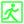
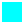

- Compatible with Steam save game cloud sync, but don't use on runs that you started in vanilla Barony
- No need to copy/move any files; just start `distributable\Launch Quality Barony.bat`.

<strong>Install Options</strong>

1) Download this repository as a ZIP and extract it anywhere (not in the game's folder)
2) Or just clone this repository. [GitHub Desktop](https://desktop.github.com) works without an account

## Features

~~Vanilla~~ | unchanged | `Quality`

<strong>EXP Multipliers</strong>

| EXP Receiver | Range | Solo | 2 players | 3 players | 4 players |
|---|---:|---:|---:|---:|---:|
| Ordinary follower (other player last hits) | ~~\~6,250 tiles~~ `Global` | — | ~~0%~~ `100%` | ~~0%~~ `90%` | ~~0%~~ `80%` |
| Ordinary follower (its player last hits) | ~~\~6,250 tiles~~ `Global` | ~~100%~~ `125%` | ~~90%~~ `100%` | ~~80%~~ `90%` | ~~70%~~ `80%` |
| Ordinary follower (it last hits) | ~~\~6,250 tiles~~ `Global` | ~~200%~~ `125%` | ~~190%~~ `100%` | ~~180%~~ `90%` | ~~170%~~ `80%` |
| Conjurer summon (other player last hits) | ~~\~6,250 tiles~~ `Global` | — | ~~0%~~ `100%` | ~~0%~~ `90%` | ~~0%~~ `80%` |
| Conjurer summon (its player last hits) | ~~\~6,250 tiles~~ `Global` | ~~100%~~ `125%` | ~~100%~~ `100%` | ~~100%~~ `90%` | ~~100%~~ `80%` |
| Conjurer summon (it last hits) | ~~\~6,250 tiles~~ `Global` | ~~200%~~ `125%` | ~~200%~~ `100%` | ~~200%~~ `90%` | ~~200%~~ `80%` |
| Player (last hits) | Global | 100% | 90% | 80% | 70% |
| Player (any follower last hits) | Global | 100% | 90% | 80% | 70% |
| Player (other player last hits) | Global | — | 90% | 80% | 70% |

Player shares have a 3-EXP minimum. Follower gains use integer rounding without a minimum.

<strong>Minimap Behavior</strong>

- <code>[untested]</code> <code>Quality marker states are pushed to Quality clients immediately. Unacknowledged updates retry every 0.3 seconds for up to 10 seconds.</code>
- <code>[untested]</code> <code>When any player views an “Exit dungeon floor” dialog, every , , , and  is revealed for the entire team until the next floor.</code>
- <code>Quality markers clear when a floor loads or reloads.</code>

<strong>Minimap Legend</strong>

<table>
  <thead>
    <tr><th>Vanilla</th><th>Quality</th><th>Meaning</th><th>Remarks</th></tr>
  </thead>
  <tbody>
    <tr><td></td><td></td><td>Unknown area or no floor</td><td>—</td></tr>
    <tr><td></td><td></td><td>Explored walkable floor</td><td>—</td></tr>
    <tr><td></td><td></td><td>Explored wall</td><td>—</td></tr>
    <tr><td></td><td></td><td>Mapped but unseen floor</td><td>—</td></tr>
    <tr><td></td><td></td><td>Mapped but unseen wall</td><td>—</td></tr>
    <tr><td></td><td></td><td>Map highlight</td><td>Blinks briefly.</td></tr>
    <tr><td></td><td></td><td>Player 1 / you</td><td><code>In online multiplayer, Quality always shows you in white.</code></td></tr>
    <tr><td></td><td></td><td>Players 2–4</td><td><code>[untested]</code> <code>In online multiplayer, the other players always use these colors and are never white.</code></td></tr>
    <tr><td> </td><td> </td><td>Followers</td><td><code>In online multiplayer, Quality always shows your followers in white; other players' followers are never white. Shadow tags gray the outline.</code></td></tr>
    <tr><td> </td><td> </td><td>Ghosts</td><td><code>[untested]</code> <code>In online multiplayer, Quality always shows your ghost in white; other players' ghosts are never white.</code></td></tr>
    <tr><td> </td><td> </td><td>Player ping or callout</td><td><code>[untested]</code> <code>In online multiplayer, Quality always shows yours in white; other players' are never white.</code> Blinks, then fades; callouts blink the targeted player's arrow.</td></tr>
    <tr><td> </td><td> </td><td>Death marker or player loot bag</td><td><code>[untested]</code> <code>In online multiplayer, Quality always shows yours in white; other players' are never white.</code> Death markers fade after about 9 seconds.</td></tr>
    <tr><td></td><td></td><td>Minotaur</td><td><code>[untested]</code> <s>Blinks.</s> <code>Does not blink.</code></td></tr>
    <tr><td></td><td></td><td>Radius ping</td><td>Expands and fades.</td></tr>
    <tr><td></td><td></td><td>Bounty target</td><td>Pulses.</td></tr>
    <tr><td></td><td></td><td>Shadow-tagged creature</td><td><code>[untested]</code> <code>Also grays player and follower arrows.</code></td></tr>
    <tr><td></td><td></td><td>Exit, ladder, or portal</td><td><s>Blinks.</s> <code>Does not blink.</code> Appears after exploration or exit reveal.</td></tr>
    <tr><td></td><td></td><td>Boulder</td><td><code>[untested]</code> Appears on explored tiles.</td></tr>
    <tr><td></td><td></td><td>Workbench</td><td><code>[untested]</code> Appears on explored tiles.</td></tr>
    <tr><td></td><td></td><td>Cauldron</td><td><code>[untested]</code> Appears on explored tiles.</td></tr>
    <tr><td></td><td></td><td>Highlighted item, donation, or pinpointed target</td><td>Blinks for items and donations; pinpointed targets last for the effect duration.</td></tr>
    <tr><td></td><td></td><td>Unused chest, grave, fountain, or sink; unbroken loot-bearing container; uninteracted pickable item; loose ground gold</td><td><code>Appears only through the team-wide exit reveal, never through exploration. Breakable-container markers are limited to containers that hold an item or gold, such as a jar, urn, crate, or barrel; ordinary furniture such as tables, chairs, and beds is excluded.</code> <code>Loose gold is included regardless of pile size, player origin, or temporary invisibility, but gold still inside a container is excluded.</code> <code>Successful use removes interactable markers. If multiple item markers occupy the same minimap tile, this marker is displayed on top.</code></td></tr>
    <tr><td></td><td></td><td>Party-dropped pickable item</td><td><code>Follows party-handled items until pickup or removal; keeps one identity across pickups and drops; overrides other item markers. An item revealed in green stays green when a pickup fails and the game immediately drops it again. Online behavior is untested.</code></td></tr>
    <tr><td></td><td></td><td>Detected hostile</td><td><code>[untested]</code> Persists while hostile and detected by vision, Ring of Warning, or artifact boots.</td></tr>
    <tr><td></td><td></td><td>Scrying target</td><td>Blinks while scrying is active.</td></tr>
    <tr><td></td><td></td><td>Other temporary or gyro-detected target</td><td>Blinks while the reveal is active.</td></tr>
  </tbody>
</table>

